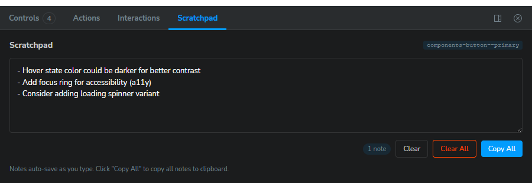
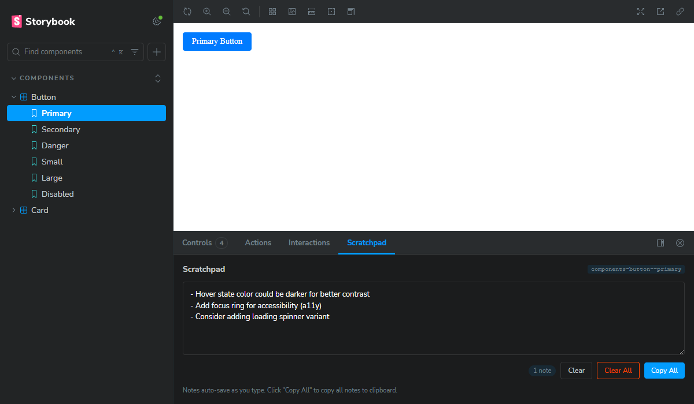

# storybook-addon-scratchpad

A lightweight Storybook addon for capturing component feedback during design reviews. Take notes on each story, then copy everything as markdown to paste into your workflow.



## Why This Exists

When doing component design reviews—especially with AI coding agents—I needed a way to jot down feedback as I clicked through stories, then paste all my notes back into chat for fixes. Every existing solution required external services, accounts, or backend setup.

This addon is intentionally lo-fi: notes save to localStorage, export as markdown, and that's it. No hosting, no accounts, no complexity. Just a scratchpad that lives in your Storybook.

**The workflow:**
1. Review components in Storybook, noting issues as you go
2. Click "Copy All" to get markdown-formatted feedback
3. Paste into your AI agent, issue tracker, or team chat
4. Fixes get made, repeat

## Features

- **Per-story notes** - Each story gets its own scratchpad
- **Auto-save** - Notes save automatically as you type (500ms debounce)
- **localStorage persistence** - No backend required, notes persist in browser
- **Markdown export** - Copy all notes formatted as markdown with one click
- **Storybook theming** - Matches your Storybook theme (light/dark)

## Installation

```bash
npm install storybook-addon-scratchpad
```

## Usage

Add the addon to your `.storybook/main.js` (or `.storybook/main.ts`):

```js
export default {
  addons: [
    // ... other addons
    'storybook-addon-scratchpad',
  ],
};
```

That's it! A "Scratchpad" panel will appear in your Storybook's addon panel.

## How It Works

1. Select any story in Storybook
2. Open the "Scratchpad" panel in the addon panel area
3. Type your notes - they auto-save as you type
4. Navigate to other stories - each has its own notes
5. Click "Copy All" to export all notes as markdown



## Panel Actions

| Action | Description |
|--------|-------------|
| **Clear** | Remove notes for the current story |
| **Clear All** | Remove all notes (with confirmation) |
| **Copy All** | Copy all notes as markdown to clipboard |

## Exported Markdown Format

When you click "Copy All", notes are formatted for easy pasting:

```markdown
## Storybook Feedback

### components-button--primary
- hover state is missing
- focus ring not visible enough for a11y

### components-card--default
- add a subtle box-shadow variant
- padding feels tight on mobile
```

## Compatibility

- Storybook 8.x, 9.x, 10.x
- React 18.x, 19.x
- Works with all Storybook frameworks (React, Vue, Angular, Svelte, etc.)

## Use Cases

- **AI agent workflows** - Review components, collect feedback, paste to your coding agent for fixes
- **Design reviews** - Capture feedback during design critiques without leaving Storybook
- **QA testing** - Document issues as you find them, export for bug tracking
- **Async collaboration** - Share component feedback via Slack, GitHub issues, or PRs

## Development

```bash
# Install dependencies
npm install

# Build
npm run build

# Watch mode
npm run dev

# Lint
npm run lint

# Type check
npm run typecheck
```

## License

MIT
